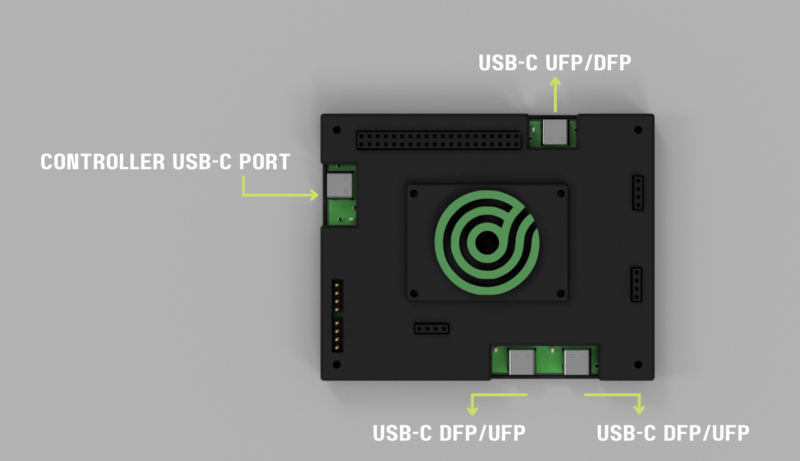

# Firmware for USB C switch

## Rev-C

Firmware for USB switch can be found under [firmware](/firmware/) folder.

Building and flashing instruction are available in the [README](/firmware/README.md)

Testing instruction are also available in the [README](/firmware/README.md)

There is code that is auto generated using STM32CubeMX and can be found under the [generated folder](/firmware/generated). Instructions to work with the generate code can be found [here](/firmware/generated/README.md)

Operational logic for the USB switch can be found under [usb_switch_code](/firmware/usb_switch_code) 

## Product photos Rev-C

## Product photos Rev-A/Rev-B

