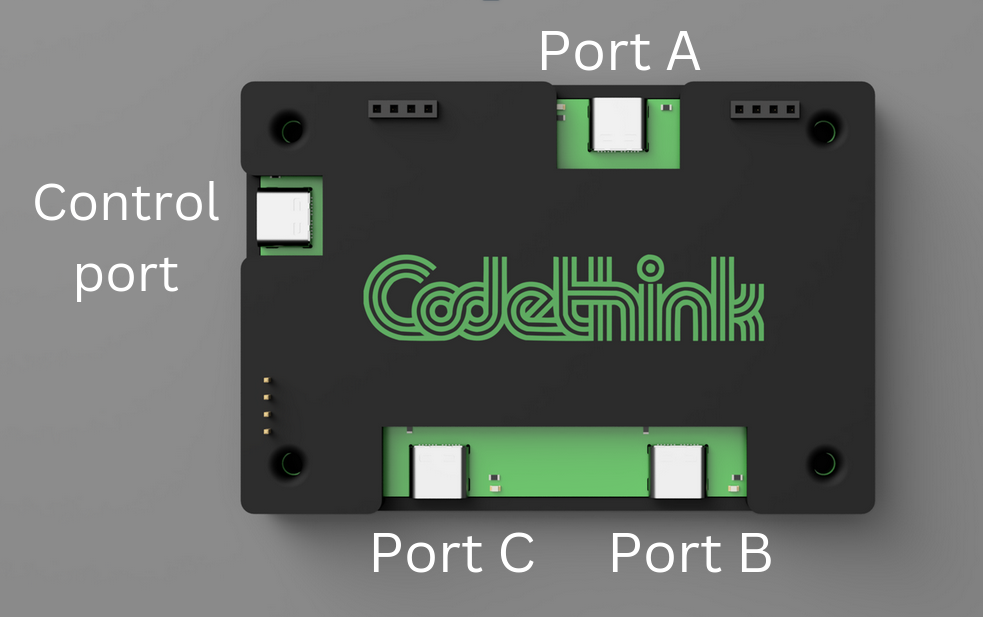

# USB Switch Rev-A firmware

## About

Firmware for the USB Switch written using STM's toolchian

## How to use and test



USB switch is configured to be a USB CDC device. Send the following command using a serial terminal to operate the switch. Each command sent should result in corresponding message being printed to the serial terminal. 

| Command       | A      | B      | C      | Message             |
|---------------|--------|--------|--------|---------------------|
| "AT"          | -      | -      | -      | "OK\n"              |
| "AT+GMR\n"    | -      | -      | -      | Returns device info |
| "AT+PORT=1\n" | Bi-dir | 0      | Bi-dir | "OK\n"              |
| "AT+PORT=2\n" | Bi-dir | Bi-dir | 0      | "OK\n"              |
| "AT+PORT=3\n" | Sink   | 0      | Source | "OK\n"              |
| "AT+PORT=4\n" | Sink   | Source | 0      | "OK\n"              |
| "AT+PORT=5\n" | Source | 0      | Sink   | "OK\n"              |
| "AT+PORT=6\n" | Source | Sink   | 0      | "OK\n"              |
| "AT+PORT=7\n" | POWER  | POWER  | POWER  | "OK\n"              |
| "AT+PORT=?\n" | -      | -      | -      | "\r2\r\nOK\r\n"     |
| "AT+PORT?\n"  | -      | -      | -      | Returns which ports are active<br/> *Output can be:*<br/><ul><li>"\rA source B sink\r\n"</li><li>"\rA source C sink\r\n"</li><li>"\rB source A sink\r\n"</li><li>"\rC source A sink\r\n"</li><li>"\rBi-Dir A - C\r\n"</li><li>"\rBi-Dir A - B\r\n"</li><li>"\rAll ports power on\r\n"</li></ul>|

## Testing instructions 

* Connect the switch to the host computer using a USB-C cable. The switch should get discovered as a USB CDC device.
* Use a serial terminal (screen, putty etc.) to interact with the device.
* Send the commands listed in the table above and make sure the respective message is printed to the terminal. 
* Try sending the [list of commands](/firmware/test/test_commands.txt) (if on linux use `cat <path>/test/test_commands/txt > /dev/tty<DEV>`) to the device. Make sure the device is still responsive after the test.

### Using USB-C to USB-C cable

If you are using a USB-C to USB-C cable to connecting a peripheral to host and the peripheral does not seem to connect, *try flipping* the USB-C connector's orientation of the USB C cable.

## Files to look into for USB switch code

### Code for handling AT commands

[usb_switch_code](/firmware/usb_switch_code/)

### Code for handling USB line switching

[usb_switch_code](/firmware/firmware/usb_switch_code/)

### Code for handling USB CDC communication

[usb_switch_code](/firmware/usb_switch_code/)
[USB_DEVICE](/firmware/generated/USB_DEVICE/App/)

## How to build

Make sure you have `gcc-arm-none-eabi` compiler installed on your system.

Run the following commands to build

```
cd generated/Debug
make -j all
```

## How to flash

### Hardware setup

Connect an ST-LINK programmer to the SWD header on the USB-C switch PCB.

### Software setup

#### Requirements

You may use either one of:
* [stlink-tools](https://github.com/stlink-org/stlink) (CLI)
* [STM32CubeProgrammer](https://wiki.st.com/stm32mpu/wiki/STM32CubeProgrammer) (GUI)

#### stlink-tools

Make sure you have the `stlink-tools` package installed on your system.

Run `make flash` from within the directory `generated/Debug/`.

#### STM32CubeProgrammer

Refer to the [official documentation](https://wiki.st.com/stm32mpu/wiki/STM32CubeProgrammer) for how to flash the compiled `.bin` file, which should be in `generated/Debug/` if you compiled the firmware successfully.

### Optional dependencies (for debugging)

On Debian:

```
apt install \
    gdb-multiarch \
    openocd
```
